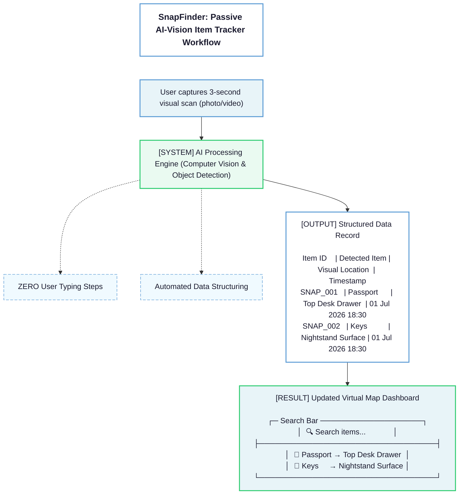

```mermaid
flowchart TD
    classDef title fill:#fff,stroke:#5b9bd5,stroke-width:2,color:#1a1a2e,font-size:18,font-weight:bold
    classDef start fill:#e8f4f8,stroke:#5b9bd5,stroke-width:2,color:#1a1a2e
    classDef process fill:#eafaf1,stroke:#2ecc71,stroke-width:2,color:#1a1a2e
    classDef label fill:#f0faff,stroke:#5b9bd5,stroke-width:1,stroke-dasharray:6 3,color:#1a1a2e
    classDef output fill:#fff,stroke:#5b9bd5,stroke-width:2,color:#1a1a2e
    classDef result fill:#e8f4f8,stroke:#2ecc71,stroke-width:2,color:#1a1a2e

    T["SnapFinder: Passive AI-Vision Item Tracker Workflow"]

    A["User captures 3-second visual scan (photo/video)"]
    B["[SYSTEM] AI Processing Engine (Computer Vision & Object Detection)"]
    L1["ZERO User Typing Steps"]
    L2["Automated Data Structuring"]

    O["[OUTPUT] Structured Data Record<br/><br/>Item ID    | Detected Item | Visual Location  | Timestamp<br/>SNAP_001   | Passport      | Top Desk Drawer  | 01 Jul 2026 18:30<br/>SNAP_002   | Keys          | Nightstand Surface | 01 Jul 2026 18:30"]

    R["[RESULT] Updated Virtual Map Dashboard<br/><br/>┌─ Search Bar ───────────────────┐<br/>│  🔍 Search items...             │<br/>├─────────────────────────────────┤<br/>│  🛂 Passport → Top Desk Drawer  │<br/>│  🔑 Keys     → Nightstand Surface │<br/>└─────────────────────────────────┘"]

    T ~~~ A
    A --> B
    B -.-> L1
    B -.-> L2
    B --> O
    O --> R

    class T title
    class A start
    class B process
    class L1,L2 label
    class O output
    class R result
```
